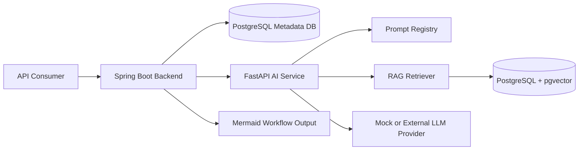
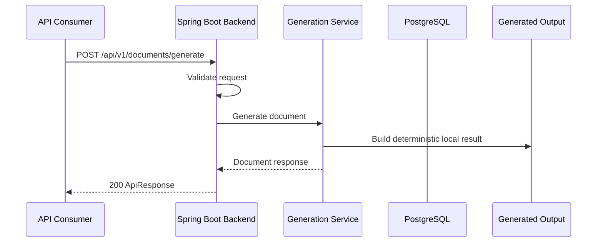
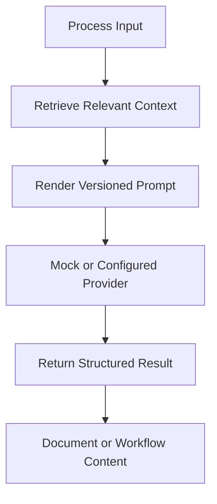
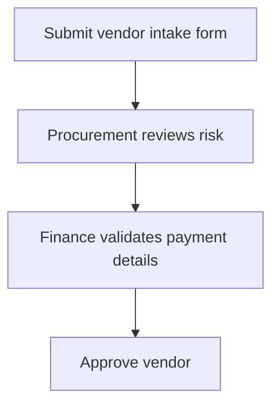

# FlowForge AI

[](https://github.com/Deepudk04/flowforge-ai/actions/workflows/ci.yml)

FlowForge AI is an enterprise-style AI platform for generating structured process documents, compliance-style documentation, and workflow diagrams from business/process inputs. It combines a Spring Boot backend, Python FastAPI AI service, prompt orchestration, RAG-style retrieval, PostgreSQL/pgvector, and Mermaid diagram generation.

## Problem Statement

Teams often maintain process documents, workflow diagrams, SOPs, and compliance-style documentation manually. This is slow, inconsistent, hard to update, and difficult to connect with existing context. FlowForge AI addresses that workflow by accepting structured or semi-structured process inputs, retrieving relevant context, rendering versioned prompts, generating structured documents, and producing Mermaid workflow diagrams.

## What FlowForge AI Does

- Exposes Spring Boot APIs for document generation, workflow diagram generation, generation job lookup, and template discovery.
- Provides deterministic local generation paths so the project can run without real LLM credentials.
- Includes a FastAPI AI service with configuration, health/readiness endpoints, prompt templates, mock provider support, retrieval interfaces, in-memory retrieval, and pgvector adapter code.
- Generates Mermaid diagrams from structured workflow steps.
- Stores backend metadata through PostgreSQL-oriented JPA entities and Flyway migrations.
- Documents a public-safe architecture using synthetic examples only.

## Architecture Overview



The current public version prioritizes backend API structure, testable local behavior, and public-safe AI-layer scaffolding. The backend uses local deterministic generation for the implemented endpoints; the AI service contains the prompt orchestration and retrieval pieces needed to evolve the integration without committing provider credentials or private prompts.

## Key Features

- Document generation endpoint with validation-friendly request DTOs.
- Workflow diagram endpoint that converts step definitions into Mermaid.
- Generation job and template registry APIs.
- Spring Security resource-server skeleton with local demo mode disabled by default.
- Correlation ID support and log masking for sensitive header/value names.
- FastAPI service health/readiness endpoints.
- Versioned prompt templates for document and workflow generation.
- Mock LLM provider for credential-free local development.
- In-memory retrieval and pgvector adapter boundaries.
- Docker Compose support for local PostgreSQL and backend startup.

## Tech Stack

| Layer | Technology |
| --- | --- |
| Backend API | Java 21, Spring Boot 3.5, Spring Web, Validation |
| Persistence | PostgreSQL, JPA, Flyway |
| Security | Spring Security, OAuth2 resource-server skeleton |
| API Docs | springdoc OpenAPI / Swagger UI |
| AI Service | Python, FastAPI, Pydantic |
| AI Orchestration | Prompt renderer, mock provider, provider interface |
| Retrieval | In-memory retriever, pgvector adapter |
| Diagrams | Mermaid |
| Local Runtime | Docker Compose |
| CI | GitHub Actions for Python and Java checks |

## Request Flow



## AI Pipeline



The AI service currently supports this pipeline through application code and tests without requiring real model credentials. Local defaults use mock provider behavior so contributors can run checks safely.

## Backend API Overview

| Endpoint | Purpose |
| --- | --- |
| `GET /api/v1/health` | Backend health metadata |
| `POST /api/v1/documents/generate` | Generate a structured document from process context |
| `POST /api/v1/workflows/diagram` | Generate a Mermaid workflow diagram from ordered steps |
| `GET /api/v1/generation-jobs/{jobId}` | Retrieve generation job metadata |
| `GET /api/v1/templates` | List available public-safe generation templates |

Swagger UI is available at `http://localhost:8080/swagger-ui.html` when the backend is running.

## Sample Input/Output

Document request:

```json
{
  "title": "Vendor Approval SOP",
  "documentType": "standard-operating-procedure",
  "inputContext": "A requester submits a vendor intake form. Procurement reviews risk, finance validates payment details, and legal reviews contract terms before approval.",
  "tags": ["vendor", "procurement", "approval"]
}
```

Document response shape:

```json
{
  "data": {
    "documentId": "doc_...",
    "title": "Vendor Approval SOP",
    "documentType": "standard-operating-procedure",
    "content": "# Vendor Approval SOP\n\nA requester submits...",
    "status": "COMPLETED",
    "createdAt": "2026-07-09T00:00:00Z"
  }
}
```

Workflow request:

```json
{
  "title": "Vendor Approval Workflow",
  "steps": [
    {"id": "intake", "label": "Submit vendor intake form", "nextStepId": "procurement_review"},
    {"id": "procurement_review", "label": "Procurement reviews risk", "nextStepId": "finance_review"},
    {"id": "finance_review", "label": "Finance validates payment details", "nextStepId": "approval"},
    {"id": "approval", "label": "Approve vendor"}
  ]
}
```

Mermaid output shape:



Additional synthetic examples:

- [Document request](samples/input/process-document-request.sample.json)
- [Workflow diagram request](samples/input/workflow-diagram-request.sample.json)
- [Generated document](samples/output/generated-document.sample.md)
- [Workflow diagram](samples/output/workflow-diagram.sample.mmd)
- [API response examples](samples/output/api-response.sample.json)

## Local Setup

Run the AI service:

```bash
cd ai-service
python -m venv .venv
.venv\Scripts\activate
pip install -r requirements.txt
copy .env.example .env
python -m compileall app tests
pytest -v
uvicorn app.main:app --reload
```

Run backend checks and application:

```bash
cd backend
mvn test
mvn spring-boot:run
```

Run PostgreSQL and the backend with Docker Compose:

```bash
docker compose up --build
```

## Testing

The CI workflow validates both services:

- AI service: install dependencies, compile `app` and `tests`, run `pytest -v`.
- Backend: set up Java 21 and run `mvn test`.

The test suites are designed to use local/mock behavior and should not require real LLM credentials.

## Public Repository Disclaimer

This repository is a sanitized public portfolio version built with synthetic examples and generic workflows. It does not contain proprietary business logic, client data, production credentials, internal prompts, private documents, or company-specific assets.

## Design Decisions

- **Spring Boot backend:** keeps API design, validation, persistence, OpenAPI, and security concerns in a mature enterprise stack.
- **FastAPI AI service:** isolates AI orchestration and provider-specific concerns from backend business APIs.
- **Separate services:** allows the AI layer to evolve independently while the backend owns API contracts and persistence.
- **PostgreSQL and pgvector:** supports normal metadata storage and vector retrieval with one operational database family.
- **Mermaid diagrams:** produces text-first workflow diagrams that are easy to diff, review, and render in GitHub.
- **Mock provider:** makes tests and local demos deterministic without real API keys.
- **Versioned prompts:** keeps prompt behavior explicit and reviewable.

More detail:

- [System architecture](docs/architecture.md)
- [Backend architecture](docs/backend-architecture.md)
- [AI layer design](docs/ai-layer-design.md)
- [RAG pipeline](docs/rag-pipeline.md)
- [API design](docs/api-design.md)
- [Security notes](docs/security.md)
- [Local development](docs/local-development.md)
- [Design decisions](docs/design-decisions.md)
- [Roadmap](docs/roadmap.md)

## Trade-Offs

- The public version favors deterministic local behavior over real provider calls, so reviewers can run it safely.
- The backend currently returns synchronous generation responses; asynchronous queues would be a better fit for long-running production generation.
- Retrieval code is intentionally lightweight in the public version and avoids real private documents.
- The FastAPI service has orchestration primitives, but the backend-to-AI-service HTTP integration is not yet fully wired into the public endpoints.

## Roadmap

- Wire backend generation services to the FastAPI AI service through a resilient HTTP client.
- Add async generation jobs with queue-backed processing.
- Expand sample outputs for more compliance-style document types.
- Add document export formats such as Markdown, PDF, and DOCX.
- Add retrieval quality scoring and prompt evaluation fixtures.
- Introduce rate limiting, authentication hardening, and observability dashboards.
- Add Testcontainers-backed integration tests for PostgreSQL.
