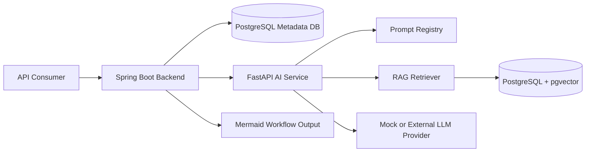
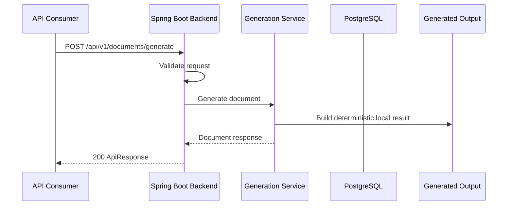
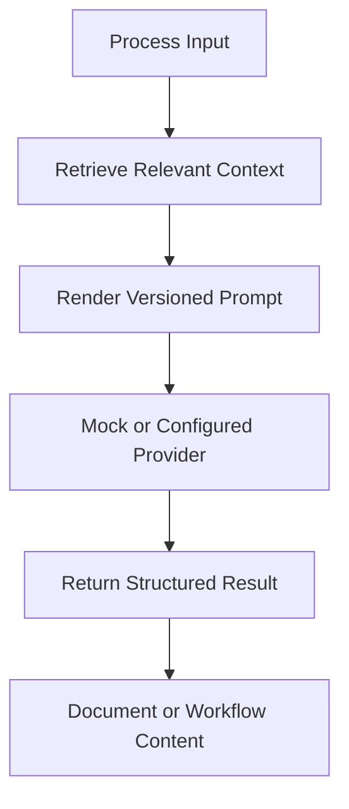
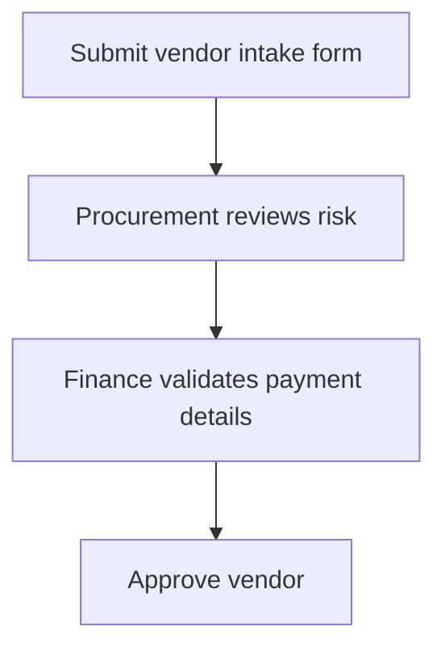

# FlowForge AI

[](https://github.com/Deepudk04/flowforge-ai/actions/workflows/ci.yml)

FlowForge AI is an enterprise-style AI platform for generating structured process documents, compliance-style documentation, and Mermaid workflow diagrams from business process inputs.

The project combines a Spring Boot backend, a FastAPI AI service, prompt orchestration, retrieval interfaces, PostgreSQL/pgvector boundaries, deterministic local generation, and synthetic examples that are safe to run without private data or real LLM credentials.

## Table of Contents

- [Why It Exists](#why-it-exists)
- [What It Does](#what-it-does)
- [Architecture](#architecture)
- [Tech Stack](#tech-stack)
- [API Overview](#api-overview)
- [Example Requests](#example-requests)
- [Local Development](#local-development)
- [Testing](#testing)
- [Project Structure](#project-structure)
- [Design Notes](#design-notes)
- [Documentation](#documentation)
- [Roadmap](#roadmap)

## Why It Exists

Teams often maintain SOPs, workflow diagrams, compliance-style documents, and process references manually. That work is slow, repetitive, inconsistent, and difficult to update when process context changes.

FlowForge AI models a safer generation workflow:

1. Accept structured or semi-structured process input.
2. Retrieve relevant context through a dedicated AI service boundary.
3. Render versioned prompts.
4. Generate reviewable document or workflow output.
5. Store and expose generation metadata through backend APIs.

The public repository focuses on architecture, contracts, tests, and deterministic local behavior. It intentionally avoids production credentials, private prompts, client data, and proprietary workflows.

## What It Does

- Generates structured process documents from business context.
- Converts ordered workflow steps into Mermaid diagrams.
- Exposes backend APIs for generation, template discovery, job lookup, and health checks.
- Provides a FastAPI AI service with health/readiness endpoints, prompt templates, mock provider support, and retrieval interfaces.
- Includes PostgreSQL-oriented JPA entities, Flyway migrations, and pgvector adapter boundaries.
- Uses deterministic local generation paths so the project can run safely without real LLM credentials.
- Documents architecture using only synthetic examples.

## Architecture



The current implementation prioritizes backend API structure, local testability, and public-safe AI-layer scaffolding. Backend endpoints use deterministic generation today; the AI service contains the orchestration, prompt rendering, and retrieval boundaries needed to evolve toward real provider-backed generation.

### Request Flow



### AI Pipeline



Local defaults use mock provider behavior so contributors can run checks without API keys or external services.

## Tech Stack

| Layer | Technology |
| --- | --- |
| Backend API | Java 21, Spring Boot 3.5, Spring Web, Bean Validation |
| Persistence | PostgreSQL, JPA, Flyway |
| Security | Spring Security, OAuth2 resource-server skeleton |
| API Docs | springdoc OpenAPI, Swagger UI |
| AI Service | Python, FastAPI, Pydantic |
| AI Orchestration | Prompt renderer, provider interface, mock provider |
| Retrieval | In-memory retriever, pgvector adapter boundary |
| Diagrams | Mermaid |
| Local Runtime | Docker Compose |
| CI | GitHub Actions for Java and Python checks |

## API Overview

| Endpoint | Purpose |
| --- | --- |
| `GET /api/v1/health` | Return backend health metadata |
| `POST /api/v1/documents/generate` | Generate a structured document from process context |
| `POST /api/v1/workflows/diagram` | Generate a Mermaid workflow diagram from ordered steps |
| `GET /api/v1/generation-jobs/{jobId}` | Retrieve generation job metadata |
| `GET /api/v1/templates` | List available public-safe generation templates |

Swagger UI is available at `http://localhost:8080/swagger-ui.html` when the backend is running.

## Example Requests

### Document Generation

```json
{
  "title": "Vendor Approval SOP",
  "documentType": "standard-operating-procedure",
  "inputContext": "A requester submits a vendor intake form. Procurement reviews risk, finance validates payment details, and legal reviews contract terms before approval.",
  "tags": ["vendor", "procurement", "approval"]
}
```

Example response shape:

```json
{
  "data": {
    "documentId": "doc_...",
    "title": "Vendor Approval SOP",
    "documentType": "standard-operating-procedure",
    "content": "# Vendor Approval SOP\n\nA requester submits...",
    "status": "COMPLETED",
    "createdAt": "2026-07-09T00:00:00Z"
  }
}
```

### Workflow Diagram Generation

```json
{
  "title": "Vendor Approval Workflow",
  "steps": [
    {
      "id": "intake",
      "label": "Submit vendor intake form",
      "nextStepId": "procurement_review"
    },
    {
      "id": "procurement_review",
      "label": "Procurement reviews risk",
      "nextStepId": "finance_review"
    },
    {
      "id": "finance_review",
      "label": "Finance validates payment details",
      "nextStepId": "approval"
    },
    {
      "id": "approval",
      "label": "Approve vendor"
    }
  ]
}
```

Generated Mermaid output:



Additional synthetic samples:

- [Document request](samples/input/process-document-request.sample.json)
- [Alternative document request](samples/input/document-request.sample.json)
- [Workflow diagram request](samples/input/workflow-diagram-request.sample.json)
- [Generated document](samples/output/generated-document.sample.md)
- [Workflow diagram](samples/output/workflow-diagram.sample.mmd)
- [API response examples](samples/output/api-response.sample.json)

## Local Development

### Run Everything With Docker Compose

```bash
docker compose up --build
```

This starts the local runtime defined in `docker-compose.yml`, including PostgreSQL and the application services.

### Run the AI Service Locally

```bash
cd ai-service
python -m venv .venv
.venv\Scripts\activate
pip install -r requirements.txt
copy .env.example .env
python -m compileall app tests
pytest -v
uvicorn app.main:app --reload
```

### Run the Backend Locally

```bash
cd backend
mvn test
mvn spring-boot:run
```

The backend starts on port `8080` by default.

## Testing

The CI workflow validates both services:

| Service | Checks |
| --- | --- |
| AI service | Install dependencies, compile `app` and `tests`, run `pytest -v` |
| Backend | Set up Java 21, run `mvn test` |

Tests are designed around local and mock behavior. They should not require real LLM credentials.

## Project Structure

```text
.
|-- ai-service/              # FastAPI AI orchestration service
|-- backend/                 # Spring Boot backend API
|-- docs/                    # Architecture and design documentation
|-- samples/                 # Synthetic request and response examples
|-- docker-compose.yml       # Local service orchestration
|-- migration.md             # Migration and project notes
|-- README.md                # Project overview
|-- SECURITY.md              # Security reporting notes
```

## Design Notes

- **Spring Boot backend:** owns API contracts, validation, persistence, OpenAPI, and security boundaries.
- **FastAPI AI service:** isolates prompt rendering, provider concerns, and retrieval logic from backend APIs.
- **Service separation:** allows AI orchestration to evolve independently from core backend contracts.
- **PostgreSQL and pgvector:** keeps metadata and vector retrieval in one operational database family.
- **Mermaid diagrams:** produces text-first workflow diagrams that are easy to diff, review, and render in GitHub.
- **Mock provider:** keeps tests and local demos deterministic without API keys.
- **Versioned prompts:** makes prompt behavior explicit and reviewable.

## Documentation

- [System architecture](docs/architecture.md)
- [Backend architecture](docs/backend-architecture.md)
- [AI layer design](docs/ai-layer-design.md)
- [RAG pipeline](docs/rag-pipeline.md)
- [API design](docs/api-design.md)
- [Security notes](docs/security.md)
- [Local development](docs/local-development.md)
- [Design decisions](docs/design-decisions.md)
- [Roadmap](docs/roadmap.md)

## Public Repository Disclaimer

This repository is a sanitized public portfolio version built with synthetic examples and generic workflows. It does not contain proprietary business logic, client data, production credentials, internal prompts, private documents, or company-specific assets.

## Trade-Offs

- The public version favors deterministic local behavior over real provider calls so reviewers can run it safely.
- Backend generation responses are currently synchronous; queue-backed processing would fit longer production workloads better.
- Retrieval code is intentionally lightweight and avoids real private documents.
- The FastAPI service has orchestration primitives, but backend-to-AI-service HTTP integration is not fully wired into the public endpoints yet.

## Roadmap

- Wire backend generation services to the FastAPI AI service through a resilient HTTP client.
- Add async generation jobs with queue-backed processing.
- Expand sample outputs for more compliance-style document types.
- Add export formats such as Markdown, PDF, and DOCX.
- Add retrieval quality scoring and prompt evaluation fixtures.
- Introduce rate limiting, authentication hardening, and observability dashboards.
- Add Testcontainers-backed integration tests for PostgreSQL.
