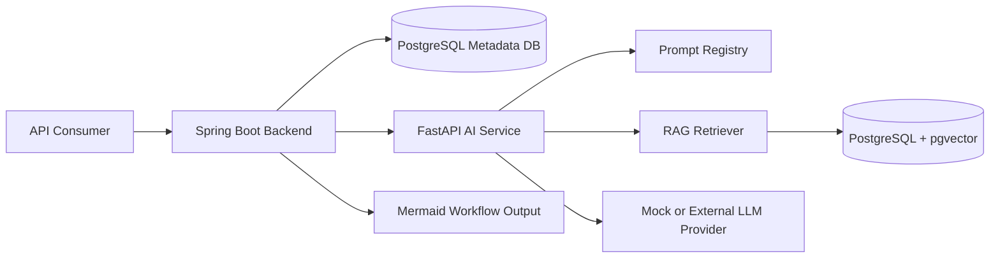
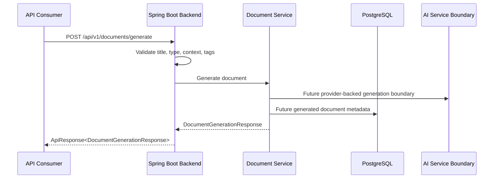
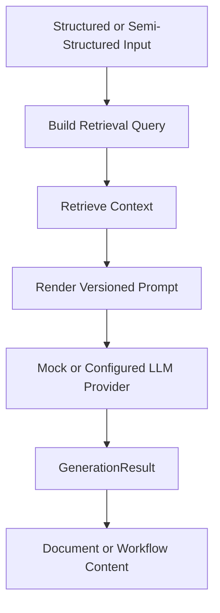
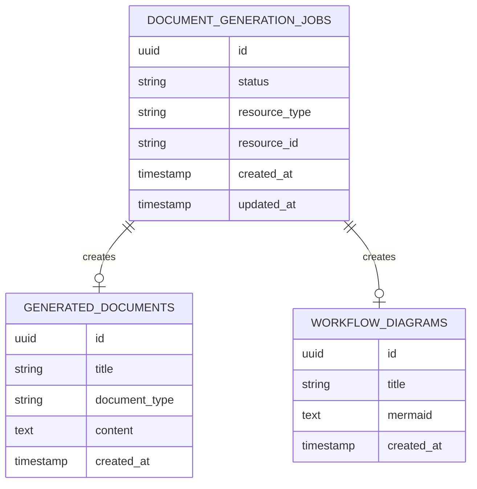

# System Architecture

FlowForge AI is split into a Spring Boot backend and a Python FastAPI AI service. The backend owns public API contracts, validation, persistence boundaries, OpenAPI metadata, and local deterministic generation paths. The AI service owns prompt rendering, retrieval abstractions, provider selection, and AI pipeline code.

## System View

## Document Generation Flow

The public backend currently returns a deterministic local document response so tests and demos do not need external AI credentials.

## AI Pipeline Flow

## Persistence Overview

The schema is intentionally generic and contains no seed data, client names, private prompts, or production identifiers.
