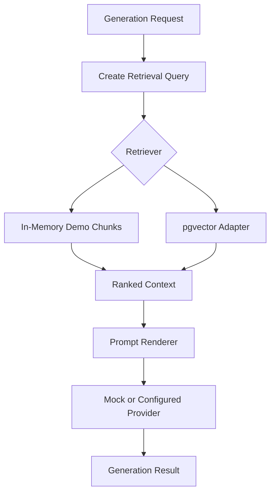

# RAG Pipeline

The AI service contains retrieval-oriented building blocks without committing private documents or requiring a production vector database.

## Pipeline

## Current Implementation

- `InMemoryRetriever` supports deterministic local tests and demos.
- `PgVectorRetriever` defines the production-oriented adapter boundary for PostgreSQL with pgvector.
- `HashEmbeddingProvider` creates deterministic local embeddings for adapter-level tests and public examples.
- `DocumentGenerationPipeline` retrieves context, enriches the generation request, and delegates prompt rendering/provider execution to the orchestrator.

## Retrieval Contract

Retrieval requests include a query and limit. Retrieval responses include:

- source chunk ID
- title
- content
- metadata
- normalized score

## Public Version Constraints

The repository does not include real document corpora, embedding indexes, private files, or production vector database credentials. Synthetic chunks are used to demonstrate the contract safely.
